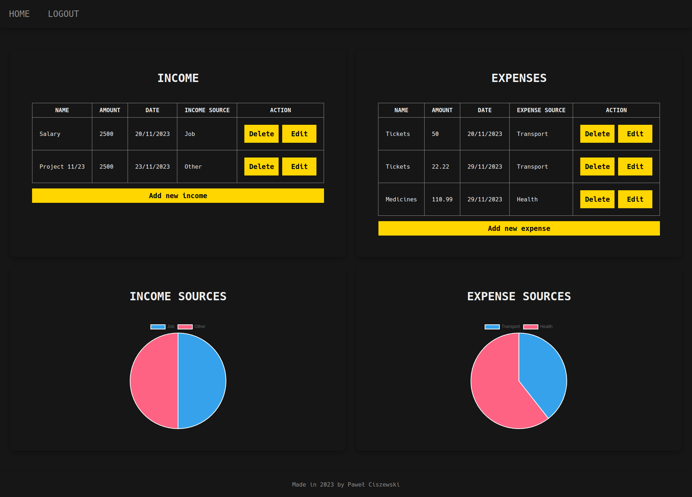

# finance-tracker-frontend

# Describe

A finance-tracker app is a digital tool designed to help users manage and monitor their financial activities, expenses, and income. This app consists of:

- frontend app (made in Vue)
- [backend up (made in Spring)](https://github.com/kardahim/finance-tracker-backend)
- database (mySql)

## Technology stack

This app uses:

- vue
- vue-router
- pinia
- axios
- dayjs
- vee-validate
- yup
- chart.js
- vue-chart.js

## Functionalities

The application offers the following capabilities:

- auth:
  - register
  - login
  - logout
  - refresh token
- finance management:
  - add income/expense
  - delete income/expense
  - edit income/expense
  - show all income/expenses
